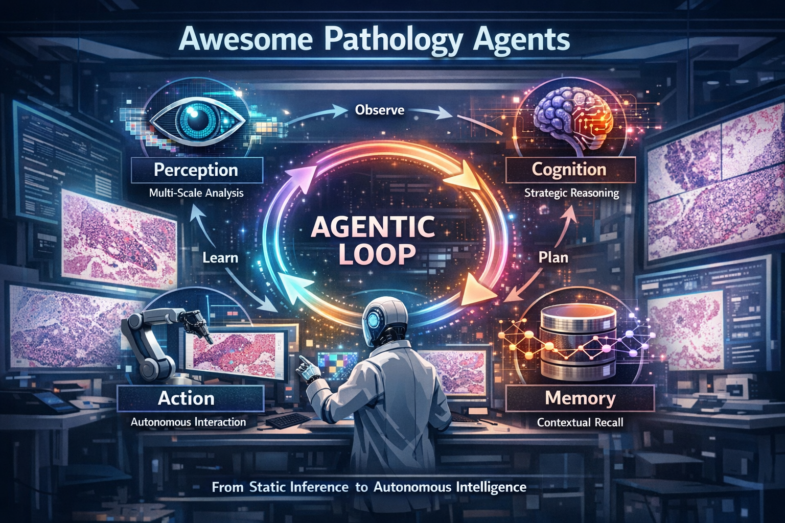

# Awesome-Pathology-Agents

Awesome papers and datasets specifically focused on computational pathology. 

- [Awesome-Pathology-Agents](#awesome-pathology-agents)
  - [Papers](#papers)
    - [Perception](#perception)
    - [Reasoning](#reasoning)
    - [Planning](#planning)
    - [Tool Use](#tool-use)
    - [Memory](#memory)
    - [Self-improvement](#self-improvement)
  - [Benchmarks / Datasets](#benchmarks)
    - [Patch Level Benchmarks](#patch-level-benchmarks)
    - [Slide Level Benchmarks](#slide-level-benchmarks)
    - [Datasets](#datasets)
  - [Contact](#contact)
  - [Star History](#star-history)

## Papers

### Perception

* [PathAlign: A vision–language model for whole slide images in histopathology](https://arxiv.org/abs/2406.19578), MICCAI COMPAYL Workshop 2024.
* [WsiCaption: Multiple Instance Generation of Pathology Reports for Gigapixel Whole-Slide Images](https://link.springer.com/chapter/10.1007/978-3-031-72083-3_51), MICCAI 2024 oral, .
* [HistGen: Histopathology Report Generation via Local-Global Feature Encoding and Cross-Modal Context Interaction](https://link.springer.com/chapter/10.1007/978-3-031-72083-3_18), MICCAI 2024, .
* [PathChat: A multimodal generative AI copilot for human pathology](https://www.nature.com/articles/s41586-024-07618-3), Nature 2024, .
* [A Knowledge-enhanced Pathology Vision-language Foundation Model for Cancer Diagnosis](https://arxiv.org/abs/2412.13126), arXiv 2024, .
* [Virchow: A Million-Slide Digital Pathology Foundation Model](https://arxiv.org/abs/2309.07778), arxiv 2023.
* [Virchow2: Scaling Self-Supervised Mixed Magnification Models in Pathology](https://arxiv.org/abs/2408.00738), arXiv 2025.
* [ALPaCA: Adapting Llama for Pathology Context Analysis to enable slide-level question answering](https://www.medrxiv.org/content/10.1101/2025.04.22.25326190v1), medrxiv 2025.
* [MUSK: A vision–language foundation model for precision oncology](https://www.nature.com/articles/s41586-024-08378-w), Nature 2025, .
* [TITAN: A multimodal whole-slide foundation model for pathology](https://www.nature.com/articles/s41591-025-03982-3), Nature Medicine 2025, .
* [UNI: Towards a general-purpose foundation model for computational pathology](https://www.nature.com/articles/s41591-024-02857-3), Nature Medicine 2024, .
* [CONCH: A visual-language foundation model for computational pathology](https://www.nature.com/articles/s41591-024-02856-4), Nature Medicine 2024, .
* [PLIP: A visual–language foundation model for pathology image analysis using medical Twitter](https://www.nature.com/articles/s41591-023-02504-3), Nature Medicine 2023, .
* [Multi-Resolution Pathology-Language Pre-training Model with Text-Guided Visual Representation](https://openaccess.thecvf.com/content/CVPR2025/html/Albastaki_Multi-Resolution_Pathology-Language_Pre-training_Model_with_Text-Guided_Visual_Representation_CVPR_2025_paper.html), CVPR 2025, .
* PathFLIP: Fine-grained Language-Image Pretraining for Versatile Computational Pathology, AAAI 2026, .
* [PathOrchestra: a comprehensive foundation model for computational pathology with over 100 diverse clinical-grade tasks](https://www.nature.com/articles/s41746-025-02027-w), npj digital medicine 2025, .
* [PathoDuet: Foundation models for pathological slide analysis of H&E and IHC stains](https://www.sciencedirect.com/science/article/abs/pii/S1361841524002147), MedIA 2024, .
* [Prov-GigaPath: A whole-slide foundation model for digital pathology from real-world data](https://www.nature.com/articles/s41586-024-07441-w), Nature 2024, .

### Reasoning

* [SlideSeek: Evidence-based diagnostic reasoning with multi-agent copilot for human pathology](https://arxiv.org/abs/2506.20964), arXiv 2025.
* [SmartPath-R1: A Versatile Pathology Co-pilot via Reasoning Enhanced Multimodal Large Language Model](https://arxiv.org/abs/2507.17303), arXiv 2025.
* [Pathology-CoT: Learning Visual Chain-of-Thought Agent from Expert Whole Slide Image Diagnosis Behavior](https://arxiv.org/abs/2510.04587), arXiv 2025, .
* [TeamPath: Building MultiModal Pathology Experts with Reasoning AI Copilots](https://www.researchsquare.com/article/rs-8098264/v1), arXiv 2025.
* [Patho-R1: A Multimodal Reinforcement Learning-Based Pathology Expert Reasoner](https://arxiv.org/abs/2505.11404), AAAI 2026, .
* [CPath-Omni: A Unified Multimodal Foundation Model for Patch and Whole Slide Image Analysis in Computational Pathology](https://openaccess.thecvf.com/content/CVPR2025/html/Sun_CPath-Omni_A_Unified_Multimodal_Foundation_Model_for_Patch_and_Whole_CVPR_2025_paper.html), CVPR 2025, .
* [SlideChat: A Large Vision-Language Assistant for Whole-Slide Pathology Image Understanding](https://openaccess.thecvf.com/content/CVPR2025/html/Chen_SlideChat_A_Large_Vision-Language_Assistant_for_Whole-Slide_Pathology_Image_Understanding_CVPR_2025_paper.html), CVPR 2025, .
* [PolyPath: Adapting a Large Multimodal Model for Multislide Pathology Report Generation](https://arxiv.org/abs/2502.10536), arxiv 2025.
* [PathAsst: A Generative Foundation AI Assistant towards Artificial General Intelligence of Pathology](https://ojs.aaai.org/index.php/AAAI/article/view/28308), AAAI 2024, .
* [WSI-LLaVA: A Multimodal Large Language Model for Whole Slide Image](https://openaccess.thecvf.com/content/ICCV2025/html/Liang_WSI-LLaVA_A_Multimodal_Large_Language_Model_for_Whole_Slide_Image_ICCV_2025_paper.html), ICCV 2025, .
* [HistoGPT: Generating dermatopathology reports from gigapixel whole slide images with HistoGPT](https://www.nature.com/articles/s41467-025-60014-x), Narture Communications 2025, .
* [PRISM2: Unlocking Multi-Modal General Pathology AI with Clinical Dialogue](https://arxiv.org/abs/2506.13063), arXiv 2025.
* [Quilt-LLaVA: Visual Instruction Tuning by Extracting Localized Narratives from Open-Source Histopathology Videos](https://www.nature.com/articles/s41586-024-07618-3), CVPR 2024, .
* [ALPaCA: Adapting Llama for Pathology Context Analysis to enable slide-level question answering](https://www.medrxiv.org/content/10.1101/2025.04.22.25326190v1), medrix 2025, [Huggingface](https://huggingface.co/CNX-PathLLM/Llama-slideQA).
* [Hulu-Med: A Transparent Generalist Model towards Holistic Medical Vision-Language Understanding](https://arxiv.org/pdf/2510.08668), arxiv 2025.

### Planning

* [PathFinder: A Multi-Modal Multi-Agent System for Medical Diagnostic Decision-Making Applied to Histopathology](https://arxiv.org/abs/2502.08916), ICCV 2025.
* [PathAgent: Toward Interpretable Analysis of Whole-slide Pathology Images via Large Language Model-based Agentic Reasoning](https://arxiv.org/abs/2511.17052), arXiv 2025, .
* [CPathAgent: An Agent-based Foundation Model for Interpretable High-Resolution Pathology Image Analysis Mimicking Pathologists’ Diagnostic Logic](https://arxiv.org/pdf/2505.20510), NeurIPS 2025.
* [SurvAgent: Hierarchical CoT-Enhanced Case Banking and Dichotomy-Based Multi-Agent System for Multimodal Survival Prediction](https://arxiv.org/abs/2511.16635), arXiv 2025.
* [GIANT: Navigating Gigapixel Pathology Images with Large Multimodal Models](https://arxiv.org/pdf/2511.19652), arxiv 2025.

### Tool Use

* [WSI-Agents: A Collaborative Multi-agent System for Multi-modal Whole Slide Image Analysis](https://arxiv.org/abs/2507.14680), MICCAI 2025, .
* [UnPuzzle: A Unified Framework for Pathology Image Analysis](https://arxiv.org/abs/2503.03152), arXiv 2025, .
* [Patho-AgenticRAG: Towards Multimodal Agentic Retrieval-Augmented Generation for Pathology VLMs via Reinforcement Learning](https://arxiv.org/abs/2508.02258), AAAI 2026, .
* [Development and validation of an autonomous artificial intelligence agent for clinical decision-making in oncology](https://www.nature.com/articles/s43018-025-00991-6?fromPaywallRec=false), Nature Cancer 2025, .

### Memory

* [Patho-AgenticRAG: Towards Multimodal Agentic Retrieval-Augmented Generation for Pathology VLMs via Reinforcement Learning](https://arxiv.org/abs/2508.02258), AAAI 2026, .
* [TissueLab: A co-evolving agentic AI system for medical imaging analysis](https://arxiv.org/abs/2509.20279), arXiv 2025, .

### Self-improvement

* [TissueLab: A co-evolving agentic AI system for medical imaging analysis](https://arxiv.org/abs/2509.20279), arXiv 2025, .

## Benchmarks

### Patch Level Benchmarks

| Dataset              | Open-ended or Close-ended                       | Number of Questions  | Number of Images   | Link     | Task |
| -------------------- | ----------------------------------------------- | -------------------- | ------------------ | -------- | ---- |
| PathMMU              | Close-ended                                     | 33,428               | 24,067             | [Data](https://huggingface.co/datasets/jamessyx/PathMMU) | Visual Question Answering |
| PathVQA              | Open-ended                                      | 32,632               | 4,289              | [Data](https://huggingface.co/datasets/flaviagiammarino/path-vqa) | Visual Question Answering |
| MicroVQA             | Close-ended                                     | 1,042(Test)          | -                  | [Data](https://huggingface.co/datasets/jmhb/microvqa) | Visual Question Answering |
| Quilt_VQA            | Open-ended                                      | 1,283                | 985                | [Data](https://huggingface.co/datasets/wisdomik/Quilt_VQA) | Visual Question Answering |

### Slide Level Benchmarks

| Dataset              | Open-ended or Close-ended                       | Number of Questions  | Number of Images   | Link     | Task |
| -------------------- | ----------------------------------------------- | -------------------- | ------------------ | -------- | ---- |
| WSI-VQA              | Open-ended and Close-ended                      | 977                  | 8,671              | [Data](https://github.com/cpystan/WSI-VQA) | Visual Question Answering |
| WSI-Bench            | Open-ended and Close-ended                      | 175,450(Train) + 4,119(Test) | 9,642(Train) + 208(Test) | [Data](https://huggingface.co/datasets/LyuLucas/WSI-Bench) | Visual Question Answering |
| SlideBench-VQA       | Close-ended                                     | 7,827(TCGA) + 7,247(BCNB) | 734(TCGA) + 1,058(BCNB)     | [Data](https://huggingface.co/datasets/General-Medical-AI/SlideChat) | Visual Question Answering |
| PathCap              | Open-ended                                      | 9,727(GTEx) captions | 7795(Train) + 948(Val) + 984(Test)| [Data](http://gtexportal.org/home/histologyPage) | Caption Generation |
| HEST-1k              | Histology-spatial transcriptomics               | 1,229 slide-st pairs | 1,229 slide-st pairs | [Data](https://huggingface.co/datasets/MahmoodLab/hest) | Gene Expression Prediction |
| STimage-1K4M         | Histology-spatial transcriptomics               | 1,149 slide-st pairs | 1,149 slide-st pairs | [Data](https://huggingface.co/datasets/jiawennnn/STimage-1K4M) | Gene Expression Prediction |

### Datasets

* [PathMMU: A Massive Multimodal Expert-Level Benchmark for Understanding and Reasoning in Pathology](https://link.springer.com/chapter/10.1007/978-3-031-73033-7_4), ECCV 2024, .
* [WSI-VQA: Interpreting Whole Slide Images by Generative Visual Question Answering](https://www.ecva.net/papers/eccv_2024/papers_ECCV/papers/05355.pdf), ECCV 2024, .
* [PathBench: Advancing the Benchmark of Large Multimodal Models for Pathology Image Understanding at Patch and Whole Slide Level](https://ieeexplore.ieee.org/abstract/document/11062674/), TMI 2025.
* [PathoGaze1.0: Eye-Tracking, Mouse Tracking, Stimulus Tracking, and Decision-Making Datasets in Digital Pathology](https://arxiv.org/abs/2510.24653), arXiv 2025.
* [PathGen-1.6M: 1.6 Million Pathology Image-text Pairs Generation through Multi-agent Collaboration](https://openreview.net/forum?id=rFpZnn11gj), ICLR 2025 oral, .
* [Quilt-1M: One Million Image-Text Pairs for Histopathology](https://proceedings.neurips.cc/paper_files/paper/2023/file/775ec578876fa6812c062644964b9870-Paper-Datasets_and_Benchmarks.pdf), NeurIPS 2023, .
* [Hest-1k: A dataset for spatial transcriptomics and histology image analysis](https://proceedings.neurips.cc/paper_files/paper/2024/file/60a899cc31f763be0bde781a75e04458-Paper-Datasets_and_Benchmarks_Track.pdf), NeurIPS 2024, .
* [STimage-1K4M: A histopathology image-gene expression dataset for spatial transcriptomics](https://proceedings.neurips.cc/paper_files/paper/2024/file/3ef2b740cb22dcce67c20989cb3d3fce-Paper-Datasets_and_Benchmarks_Track.pdf), NeurIPS 2024, Benchmark, .
* [SlideChat: A Large Vision-Language Assistant for Whole-Slide Pathology Image Understanding](https://openaccess.thecvf.com/content/CVPR2025/html/Chen_SlideChat_A_Large_Vision-Language_Assistant_for_Whole-Slide_Pathology_Image_Understanding_CVPR_2025_paper.html), CVPR 2025, .
* [WSI-LLaVA: A Multimodal Large Language Model for Whole Slide Image](https://openaccess.thecvf.com/content/ICCV2025/html/Liang_WSI-LLaVA_A_Multimodal_Large_Language_Model_for_Whole_Slide_Image_ICCV_2025_paper.html), ICCV 2025, .
* [PLIP: A visual–language foundation model for pathology image analysis using medical Twitter](https://www.nature.com/articles/s41591-023-02504-3), Nature Medicine 2023, .
* [PathCap: Evaluating and interpreting caption prediction for histopathology images](https://proceedings.mlr.press/v126/zhang20b.html), Proceedings of the 5th Machine Learning for Healthcare Conference 2020, .
* [HistGen: Histopathology Report Generation via Local-Global Feature Encoding and Cross-modal Context Interaction](https://arxiv.org/abs/2403.05396), MICCAI 2024, .
* [MultiPathQA: Navigating Gigapixel Pathology Images with Large Multimodal Models](https://arxiv.org/pdf/2511.19652), arxiv 2025.
* [PathVG: A New Benchmark and Dataset for Pathology Visual Grounding](https://link.springer.com/chapter/10.1007/978-3-032-05169-1_44), MICCAI 2025, .

## Contact 

If you have relevant works regarding pathology agents or agentic computational pathology, we welcome you to contact us (Linghan Cai: cailh@stu.hit.edu.cn; Jingyun Chen: 03chenjingyun@gmail.com) to include them in our repository.

## Star History

